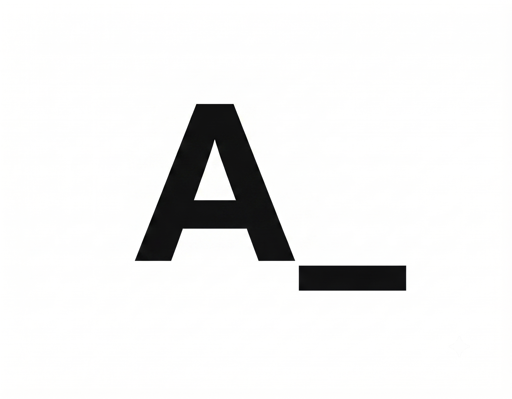

<div align="center">
  
  <h1>Aliasgar Lakkadghat</h1>
  <p><strong>AI & Data Engineer</strong></p>
  <p>Specializing in agentic workflows, LLM pipelines, data platforms, and production-ready intelligent systems.</p>

  <p>
    <a href="https://imalibtw.in/"><strong>🌐 Live Portfolio: imalibtw.in</strong></a>
  </p>

  <div>
    <a href="https://imalibtw.in/">
      
    </a>
    <a href="https://www.linkedin.com/in/aliasgarlakkadghat/">
      
    </a>
    <a href="https://github.com/alilakkadghat">
      
    </a>
    <a href="mailto:ali280306@gmail.com">
      
    </a>
  </div>
</div>

---

## ⚡ Overview

A high-performance, neubrutalist personal portfolio and engineering platform built with **React 19**, **TypeScript**, **Vite**, and **TailwindCSS v4**. Designed with a calm, technical, and personal tone to showcase production systems, architecture case studies, and engineering writing.

🌐 **Visit Live Application:** [https://imalibtw.in/](https://imalibtw.in/)

---

## ✨ Key Features

- 🏗️ **Two-Level Project Architecture**:
  - **Homepage**: Clean, minimal horizontal cards with quick stack tags and one-line summaries.
  - **Case Studies**: Editorial engineering breakdowns (`/projects/:slug`) detailing the problem, capabilities, and technical architecture behind each platform.
- 💻 **Interactive Floating Terminal (`>_`)**:
  - Retro macOS terminal modal with custom green ASCII art.
  - Command parser supporting `help`, `about`, `skills`, `projects`, `writing`, `contact`, `socials`, `resume`, `clear`, and `exit` with arrow-key history recall.
- 📝 **Zero-Config Modular Markdown Blog Engine**:
  - Add or delete `.md` files in `src/blogs/` with YAML frontmatter.
  - Automatic route generation, live reading time calculations, date formatting, and drop-cap typography.
- 🎯 **Vision & Roadmap Matrix**:
  - Neubrutalist 3-phase trajectory overview (*Foundation Building* → *Systems & Research* → *Scale & Impact*).
- 🌓 **Dynamic Theme Provider**:
  - Neubrutalist high-contrast styling with custom shadows and seamless light/dark mode switching.
- 🔍 **Comprehensive SEO & Structured Data**:
  - OpenGraph / Twitter Cards, Schema.org JSON-LD structured data (`Person`), `sitemap.xml`, `robots.txt`, `llms.txt`, and `humans.txt`.

---

## 🛠️ Tech Stack

- **Core & Framework**: React 19, TypeScript, Vite
- **Styling & UI**: TailwindCSS v4, Framer Motion, Neubrutalist Design System
- **Routing**: React Router DOM v7
- **Markdown Processing**: `react-markdown`, `remark-gfm`
- **3D & Graphics**: Three.js, WebGL

---

## 🚀 Getting Started Locally

### Prerequisites
- Node.js (v18 or higher recommended)
- npm or pnpm

### Installation

1. **Clone the repository:**
   ```bash
   git clone https://github.com/alilakkadghat/imalibtw.in.git
   cd imalibtw.in
   ```

2. **Install dependencies:**
   ```bash
   npm install
   ```

3. **Start the local development server:**
   ```bash
   npm run dev
   ```
   Open [http://localhost:5173](http://localhost:5173) in your browser.

4. **Build for production:**
   ```bash
   npm run build
   ```

---

## ✍️ Adding a New Blog Post

To publish an article, simply drop a `.md` file inside `src/blogs/`:

```markdown
---
title: "Your Article Title"
description: "A short 1-2 sentence summary."
date: 2026-09-01
tag: "BACKEND"
author: "Aliasgar Lakkadghat"
mockupType: "merchid" # options: "merchid" | "ticket" | "image" | "none"
cover: "/projects/your-image.png"
---

Your markdown content starts here...
```

The system will automatically discover the file, build the route at `/writing/<slug>`, calculate read time, and add it to the homepage and terminal.

---

## 📬 Contact & Connect

- **Website**: [imalibtw.in](https://imalibtw.in/)
- **Email**: [ali280306@gmail.com](mailto:ali280306@gmail.com)
- **LinkedIn**: [linkedin.com/in/aliasgarlakkadghat](https://www.linkedin.com/in/aliasgarlakkadghat/)
- **GitHub**: [github.com/alilakkadghat](https://github.com/alilakkadghat)

---

<div align="center">
  <sub>Designed & Developed by Aliasgar Lakkadghat.</sub>
</div>
